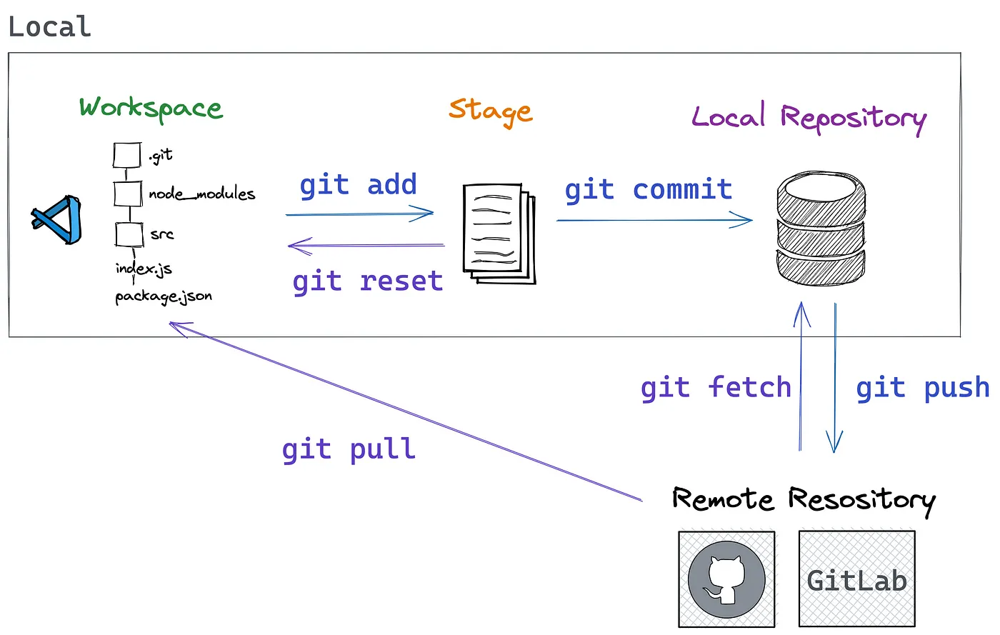

1.  Erstellen Sie einen [Github](https://github.com/)-Account oder
    melden Sie sich dort an.

2.  Beantworten Sie die Fragen in dem MS365-Formular.

    {width="60%"}

    <https://forms.office.com/e/QhDCH4hzyX>

3.  Während Sie die folgenden Schritte durchführen, können ggf.
    Wartezeiten auftreten. Nutzen Sie diese Zeiten und lesen Sie
    parallel den Abschnitt [Pandoc's
    Markdown](https://pandoc.org/MANUAL.html#pandocs-markdown).

4.  Optional, aber sehr nützlich, falls Sie macOS benutzen: Installieren
    Sie den Paketmanager [Homebrew](https://brew.sh/de/).

    Unter Windows können Sie WinGet und unter Linux den nativen
    Paketmanager Ihrer Distribution verwenden.

5.  Falls nicht vorhanden, installieren Sie in einem Terminal mithilfe
    Ihres Paketmanagers

    - [git](https://git-scm.com/)

      ``` bash
      winget install --id Git.Git -e --source winget
      ```

      oder

      ``` bash
      brew install git
      ```

    - [Visual Studio Code (VSCode)](https://code.visualstudio.com/)

      ``` bash
      winget install -e --id Microsoft.VisualStudioCode
      ```

      oder

      ``` bash
      brew install --cask visual-studio-code
      ```

    - [pandoc](https://kofler.info/free-ebooks/pandoc2.pdf)

      ``` bash
      winget install --source winget --exact --id JohnMacFarlane.Pandoc
      ```

      oder

      ``` bash
      brew install pandoc
      ```

6.  Testen Sie die Installationen,

    a.  indem Sie VSCode starten und

    b.  im einem *neuen* (Änderungen an der PATH-Variablen sind sonst
        nicht wirksam) Terminal mit

        ``` bash
        git --version
        ```

            git version 2.50.1

        ``` bash
        pandoc --version
        ```

            pandoc 3.7.0.2
            Features: +server +lua
            Scripting engine: Lua 5.4
            User data directory: /home/USERNAME/.local/share/pandoc
            Copyright (C) 2006-2024 John MacFarlane. Web: https://pandoc.org
            This is free software; see the source for copying conditions. There is no
            warranty, not even for merchantability or fitness for a particular purpose.

7.  Nehmen Sie die Gruppen-Einladung von Github an.  
    Diese erhalten Sie an Ihre dort hinterlegte E-Mail-Adresse.

8.  Optional, aber empfehlenswert, insbesonder bei macOS und Linux:
    Erstellen Sie mit `ssh-keygen` ein kryptographisches Schlüsselpaar
    und hinterlegen Sie den öffentlichen Schlüssel (dieser endet mit
    `.pub`) bei Github:  
    Avatar (rechts oben) → Settings → SSH und GPG keys → New SSH key

9.  Klonen Sie die Git-Repositories
    [lernfeld-10b](https://github.com/ARS-2023-BS-12INF/lernfeld-10b/tree/main)
    und
    [lernfeld-11b](https://github.com/ARS-2023-BS-12INF/lernfeld-11b/tree/main)
    auf Ihren Computer.

    ``` bash
    git clone https://github.com/ARS-2023-BS-12INF/lernfeld-10b.git
    ```

    ``` bash
    git clone https://github.com/ARS-2023-BS-12INF/lernfeld-11b.git
    ```

    oder, wenn Sie einen SSH-Schlüssel hinterlegt haben:

    ``` bash
    git clone git@github.com:ARS-2023-BS-12INF/lernfeld-10b.git
    ```

    ``` bash
    git clone git@github.com:ARS-2023-BS-12INF/lernfeld-11b.git
    ```

<!-- -->

1.  Installieren Sie innerhalb von VSCode die Erweiterung [Codebraid
    Preview](https://github.com/gpoore/codebraid-preview-vscode).

    Wählen Sie die folgenden Optionen in der Konfiguration der
    Erweiterung ab:

    - [ ] CSS: Use Default

    - [ ] CSS: Use Markdown Preview Font Settings

    - [ ] CSS: Use Mardown Preview Styles

2.  Bearbeiten Sie mit VSCode das Dokument
    [01-einstieg/03-einstiegstest.md](03-einstiegstest.md) in
    `lernfeld-10b`.

3.  Falls Sie noch nie auf Ihrem System Git verwendet haben, müssen Sie
    dieses konfigurieren:

    ``` bash
    git config --global user.name "Git Example"
    git config --global user.email git@example.com
    ```

4.  Fügen Sie Ihre Änderungen der Stagign-Area hinzu (`git add .`) und
    erstellen Sie einen Commit
    (`git commit -m "einstiegstest bearbeitet"`) mit Ihren Änderungen.

    

5.  Erstellen Sie in Github unter Ihrem Benutzernamen je ein
    **privates** (beim Erstellen »private« auswählen), leeres
    Git-Repository `lernfeld-10b` und `lernfeld-11b`.

6.  Setzen Sie jeweils die push-URL in ihren lokalen Git-Repositories
    auf ihr entsprechendes personliches Github-Repository:

    ``` bash
    git remote set-url --push origin <YOUR_PERSONAL_GITHUB_REPOSITORY_HTTPS_URL>
    ```

    Wenn Sie einen öffentlichen SSH-Schlüssel bei Github hinterlegt
    haben, dann verwenden Sie die SSH-URL:

    ``` bash
    git remote set-url --push origin <YOUR_PERSONAL_GITHUB_REPOSITORY_SSH_URL>
    ```

    Kontrolle

    ``` bash
    git remote -v
    ```

    ``` bash
    origin   git@github.com:ARS-2023-BS-12INF/lernfeld-1Xb.git (fetch)
    origin   <YOUR_PERSONAL_GITHUB_REPOSITORY_URL> (push) 
    ```

7.  Pushen Sie Ihre Änderung(en):

    ``` bash
    git push 
    ```

    Zur Kontrolle prüfen Sie, ob Sie Ihre Änderungen auf der
    Github-Webseite zu Ihrem personlichen Git-Repository (für
    `lernfeld-10b`) sehen können.

8.  Erteilen Sie mir jeweils (`@andrebauer`) passende Rechte, damit ich
    Ihre persönlichen Github-Repositories einsehen kann.

9.  Erstellen Sie einen Issue in Ihrem personlichen Github-Repository
    mit der Frage, ob ich ihre Bearbeitung einsehen kann. Fügen Sie dazu
    mich als Assignee hinzu.
