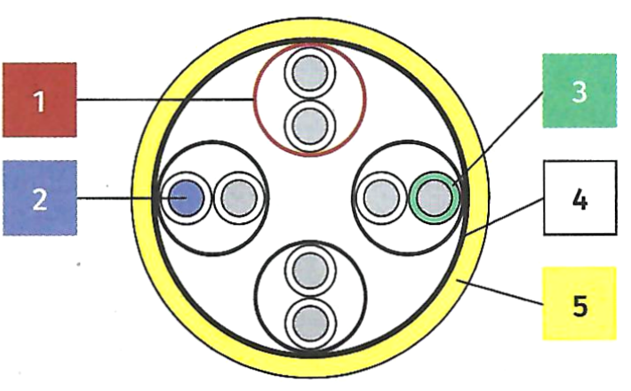
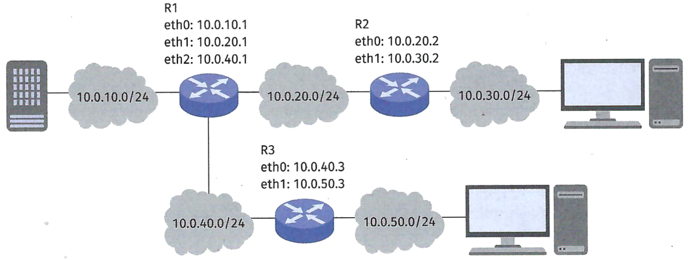

Überprüfen Sie Ihr Grundlagenwissen aus dem Lernfeld 9 »Netzwerke und
Dienste bereitstellen«.

Bearbeiten Sie die folgenden Teilaufgaben.

### Aufgabe 1

a)  Bringen Sie die folgenden Prozessschritte in eine sachlogische
    Reihenfolge.

    - Ziele, Migrationsstrategie

    - Konzeptionierung

    - Ist-Analyse

    - Betrieb

    - Umsetzung

<!-- -->

b)  Beschreiben Sie die folgenden Aspekte des Projektmanagements in
    eigenen Worten.

    - Aufwandsabschätzung

    - Abnahme

    - Projektstrukturplan

    - Stakeholder-Analyse

<!-- -->

c)  Geben Sie je zwei Aspekte an, die in einem Lasten- bzw.
    Pflichtenheft enthalten sind.

### Aufgabe 2

Entscheiden Sie, ob die folgenden Aussagen richtig oder falsch sind.

a)  DevOps steht für Entwicklung und Betrieb eines Unternehmensbereichs.

<!-- -->

b)  Unter CI versteht man kontinuierliche Identifikation von neuen
    Anforderungen an einen Unternehmensbereich.

<!-- -->

c)  Der Bereich DevOps kann als Schnittmenge der Bereiche Entwicklung,
    Betrieb und Buchhaltung betrachtet werden.

<!-- -->

d)  Der Bereich CD umfasst das Paketxeren Freigeben, Konftguneren und
    Überwachen einer Anwendungssoftware für die Kunden.

### Aufgabe 3

a)  Ordnen Sie der Ethernet-Leitung die entsprechenden Bereiche 1-5 zu.
    Geben Sie weiterhin die Leitungsart (Kurzschreibweise) an.

    {width="50%"}

    | Nummer | Bereich        |
    |--------|----------------|
    |        | Folienschirm   |
    |        | Geflechtschirm |
    |        | Isolator       |
    |        | Ader           |
    |        |                |

    Leitungsart:

<!-- -->

b)  Es sollen die unterschiedlichen Adressierungsarten in einem Netzwerk
    betrachtet werden. Ergänzen Sie die folgende Tabelle zu den
    häufigsten Adressarten.

    | OSI-Schicht | Adressenname | Länge in Bit | Aufgabe |
    |----|----|----|----|
    | 4 |  |  | Identifikation der Anwendung bzw. des Dienstes |
    |  | MAC |  |  |
    | 3 |  |  |  |
    |  |  | 32 Bit |  |

<!-- -->

c)  Geben Sie für den folgenden Netzplan die statischen Routen für
    Router R1 an, sodass dieser alle Netze erreichen kann.

    

    | Ziel         | Next Hop | Schnittstelle |
    |--------------|----------|---------------|
    | 10.0.10.0/24 |          |               |
    | 10.0.20.0/24 |          |               |
    | 10.0.30.0/24 |          |               |
    | 10.0.40.0/24 |          |               |
    | 10.0.50.0/24 |          |               |

<!-- -->

d)  Geben Sie für die folgenden Protokolle jeweils kurz deren Aufgaben
    innerhalb eines Netzes an.

    - DNS

    - DHCP

    - SSH

    - SMB

    - IMAP

    - SNMP

### Aufgabe 4

a)  Geben Sie jeweils mindestens drei technische Anforderungen an eine
    Firewall, einen Server und ein NAS an.

<!-- -->

b)  Entscheiden Sie, welche der folgenden Funktionen in einem
    SOHO-Router vorzufinden sind.

    1.  DSL-Modem
    2.  Analog-Modem
    3.  LWL-Modem
    4.  Webserver
    5.  Telefonanlage
    6.  TFTP-Server
    7.  WLAN-Accesspoint
    8.  Repeater
    9.  Firewall

### Aufgabe 5

Berechnen Sie den Bezugspreis für einen Server mithilfe der gegebenen
Werte.

Listenbreis: 5000,00 €

Lieferrabatt: 3 %

Skonto: 2 %

Transportkosten: 5000,00 € pro 100 Stück

### Aufgabe 6

Geben Sie die Aufgabengebiete der folgenden Programme an.

Beispiel:

ip (Linux): Konfiguration und Anzeige der IP-Adressen und Routen

- bmon

- netstat

- ipconfig

- nslookup

- arp

- tracert/traceroute

### Aufgabe 7

Erklären Sie kurz die Unterschiede zwischen Docker, VirtualBox und
Proxmox.
