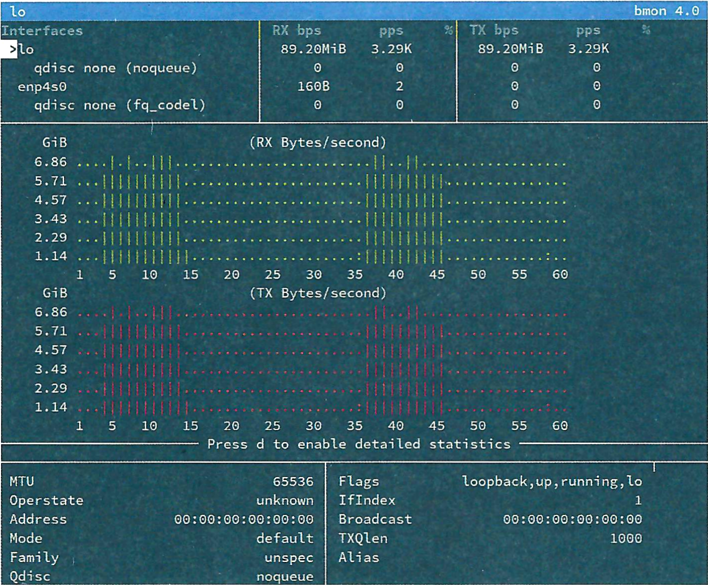
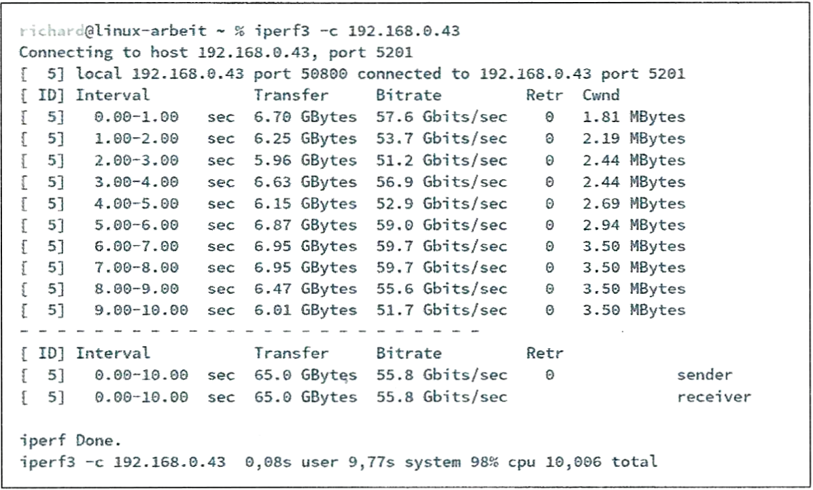
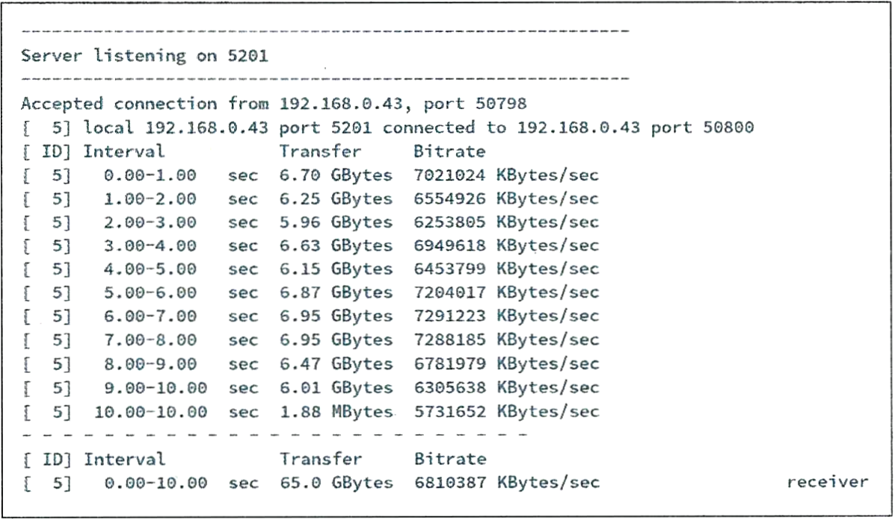

## Aufgabe 1

a)  Kreuzen Sie an, welche Informationen aus Ihrer Sicht eine
    Testspezifikation allgemein enthalten sollte.

    - [ ] Speicherort Testspezifikation

    - [ ] Erwartetes Testergebnis

    - [ ] Namen der Unternehmensleitung

    - [ ] Zielsetzung des Tests

    - [ ] Gründungsjahr der Firma

    - [ ] Durchzuführende Testschritte

    - [ ] Anschrift der Vertriebsfiliale

<!-- -->

b)  Erstellen Sie ein Vorlagendokument für Testspezifikationen und
    Testprotokolle für die Infrastruktur, in denen die folgenden
    Informationen enthalten sind:

    - verfügbare Datenraten
    - Funktionsprüfungen
    - Normalfälle
    - Fehler und Ausnahmen
    - Testszenario
    - beteiligte Personen
    - Testdauer
    - Versionshinweis

    Ergänzen Sie die Vorlage um weitere Informationen, die aus Ihrer
    Sicht sinnvoll sind.

## Aufgabe 2

Erstellen Sie eine neue Testspezifikation für den beschriebenen Test und
das entsprechende Testprotokoll zur anschließenden Durchführung des
Tests.

Im Folgenden werden die Anforderungen an den Test beschrieben.

#### Test der Übertragungsrate zwischen einem Client und einem Server in einem bestehenden Netz

| iperf3-Software | bmon-Software |
|:---|:---|
| iperf3_3. 9-1_amd64. deb | bmon_4. 0-4build1_amd64. deb |
| libiperf0_3. 9-1_amd64. deb | libconfuse2_3. 2. 1+dfsg-4_amd64. deb |
| libsctp1_1. 0. 1 8+dfsg-1_amd64.deb | libconfuse-common_3. 2. 1+dfsg 4_all.deb |
| libssl1. 1_1. 1. 0g-2ubuntu4_amd64. deb | libnl-route-3-200_3. 2. 29-0ubuntu3_amd64. deb |
|  | libnl-3-200_3. 2. 29-0ubuntu3_amd64. deb |
|  |  |

Die Monitor-Software „bmon" ist in einem terminal-Fenster gestartet und
auf die Schnittstelle eingestellt, die geprüft werden soll (z. B. eth0).
Das Speedtest-Tool „iperf3" wird für die Messung der Übertragungsrate
verwendet.

| System | Parameter      | Bemerkung                             |
|:-------|:---------------|:--------------------------------------|
| Server | `iperf —s -fK` | zeige Übertragungsrate in KByte/s     |
| Client | `iperf -c`     | starte Test zur angegebenen Server-IP |

Die Übertragungsraten werden von „iperf" in Textform angezeigt und von
„bmon" grafisch dargestellt. Die folgenden Abbildungen zeigen dies
Ausgabe.

 bmon-Monitor-Tool

 iperf-Client

 iperf-Server

Der Server muss vor dem Client gestartet werden, ansonsten wird
„connection refused" gemeldet. Mit „bmon" wird die Grundlast auf dem
Netzabschnitt festgelegt. Die von „iperf" angezeigte Übertragungsrate
„Bitrate" soll mindestens 0,2 Gbit/sec betragen und mindestens 10% der
Grundlast ausmachen. Die Testdauer beträgt ca. 1 Minute.
