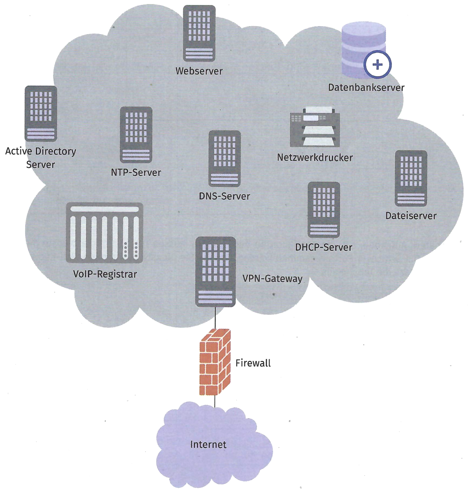

{width="75%"}

## Aufgabe 1

Erstellen Sie eine Übersicht mit den in der Skizze vorhandenen Diensten
(z. B. in einer Tabelle). Beschreiben Sie die grundlegende Funktion der
Dienste und notieren Sie ggf. einige technische Parameter (z. B. Port)
der Dienste.

| Dienst | Funktion | technische Parameter |
|----|----|----|
| DHCP - dynamic host configuration protocol | verteilt Netzwerkparameter (z. B. IPv4-Adresse und Subnetzmaske) an Clients | Port: 67, DORA-Prinzip |
|  |  |  |

::: {.solution}
- DHCP (dynamic host configuration protocol)

  verteilt dynamisch Netzwerkparameter (z. B. IPv4-Adresse und
  Subnetzmaske) an Clients, DORA-Prinzip

  Port 67 (Server) Port 68 (Client)

- NTP (network time protocoll)

  synchronisiert die Uhren von Computern und Netzwerkgeräten, um eine
  einheitliche Zeitbasis im Netzwerk sicherzustellen

- Webserver

  Bereitstellung von Webseiten und Webdiensten, z. B. Apache, Nginx,
  Caddy. Für HTTPS werden SSL-Zertifikate benötigt.

  Port: 80 (HTTP) und 443 (HTTPS)

- DNS-Server

  Z. B. Übersetzung von Domain-Namen in IP-Adressen, Wesentlicher
  Baustein für das Versenden von E-Mails.

  Port 53

- Active Directory-Server

  Active Directory ermöglicht es, ein Netzwerk entsprechend der realen
  Struktur des Unternehmens oder seiner räumlichen Verteilung zu
  gliedern. Dazu verwaltet es verschiedene Objekte in einem Netzwerk wie
  beispielsweise Benutzer, Gruppen, Computer, Dienste, Server,
  Dateifreigaben und andere Geräte wie Drucker und Scanner und deren
  Eigenschaften. Mit Hilfe von Active Directory kann ein Administrator
  die Informationen der Objekte organisieren, bereitstellen und
  überwachen.

  Ports:

      DNS   TCP/UDP 53
      Kerberos  TCP/UDP 88
      LDAP  TCP/UDP 389 (LDAP, 389/TCP, LDAP Ping 389/UDP)
      LDAP-SSL  TCP 686
      Microsoft-DS  TCP/UDP 445
      UPnP  TCP/UDP 1900, 2869
        (UPnP Framwework für Netzwerkkommunikation unter Windows)
      WINS  TCP/UDP 1512
      NetBIOS   TCP/UDP 137
      NetBIOS Datagramm UDP 138
      NetBIOS Session Service   TCP 139
      WINS Replikation  TCP/UDP 42

- VPN-Gateway

  Ein VPN-Gateway ermöglicht über ein öffentliches Netz, wie dem
  Internet, beispielsweise den sicheren Zugriff auf ein entferntes
  Firmennetzwerk, das normalerweise nicht öffentlich zugänglich ist.
  Somit können verschiedene Dienste, wie E-Mail, Intranet oder
  Laufwerksfreigaben, die eigentlich nur LAN-intern zur Verfügung
  stehen, über eine getunnelte Verbindung genutzt werden.

  Sitchworte: OpenVPN, IPSec

- Dateiserver

  Ein Dateiserver (auch Fileserver genannt) ist ein Rechner, der
  Dateisysteme oder zumindest einen Teil eines Dateisystems in einem
  Rechnernetz zur Verfügung stellt.

  Als Netzwerkprotokoll wird im Internet üblicherweise FTP, dessen
  abgesicherte Varianten SCP und SFTP oder WebDAV eingesetzt. In
  Intranets wird in Windows- und Mac-Umgebungen in der Regel SMB/CIFS
  verwendet, in Unix-Umgebungen eher NFS.

  Ports:

      SCP 22
      SFTP 22
      WebDav 80 / 443
      SMB/CIFS 445, 139, 138 und 137
      NFS 111, 2049, 1110, 4045

- Datenbankserver

  Als Datenbankserver werden Rechner bezeichnet, auf denen
  Datenbanksysteme abgelegt werden, dabei stellt der Server
  Datenverwaltungsdienste bereit, die von anderen Rechnern aus genutzt
  werden können.

  Verbreitete Datenbanksysteme sind Firebird, Oracle, DB2, Informix, der
  Microsoft SQL Server, PostgreSQL oder MySQL. Diese Softwarepakete
  verwalten die Daten und anfallenden Anfragen und Abfragen.

  Beispiele und Ports:

      MySQL 3306
      MSSQL 1433
      PostgreSQL 5432

- Netzwerkdrucker

  Als Netzwerkdrucker wird allgemein ein Drucker bezeichnet, der nicht
  direkt mit einem Computer verbunden ist, sondern wie ein
  eigenständiger Server im Rechnernetz angesprochen wird. Speziell wird
  der Begriff unter Windows für jeden Drucker im Rechnernetz verwendet,
  der über das Netz angesprochen werden kann; auch solche, die keine
  eigenständigen Geräte sind, sondern über andere Computer angesprochen
  werden.

  Druckprotokolle und Ports:

      IPP (Internet Printin Protocol) 9100 / 631 und SNMP 161 und 162
      LPD (Line Printer Daemon) 515
      SMB 445

- VoIP-Registrar

  Ein VoIP-Registrar ist ein Server, der für die Registrierung von
  VoIP-Geräten (wie IP-Telefone, Softphones oder VoIP-Gateways) in einem
  VoIP-Netzwerk verantwortlich ist. Er ist ein zentraler Bestandteil der
  Infrastruktur, die benötigt wird, um Voice-over-IP (VoIP)-Dienste
  bereitzustellen. Der Registrar nimmt die Registrierungsanfragen (SIP
  REGISTER-Nachrichten) der VoIP-Geräte über SIP entgegen. Außerdem ist
  er für das Routing von Anrufen an die VoIP-Geräte zuständing.

  Ports:

  SIP (Session Initiation Protocol) 5060, 5061 (TLS)

- Firewall

  Eine Firewall ist ein Sicherungssystem, das ein Rechnernetz oder einen
  einzelnen Computer vor unerwünschten Netzwerkzugriffen schützt.
:::

## Aufgabe 2

Für spätere Aufgaben, z. B. die Konfiguration der Firewall, müssen für
bestimmte Dienste die entsprechenden OSI-Schicht-4-Ports gesammelt
werden. Ordnen Sie Dienste bestimmten Well-Known-Ports zu. Füllen Sie
dazu die Tabelle aus.

| Dienst | Port |
|--------|-----:|
|        |  123 |
|        |   80 |
| HTTPS  |      |
|        |   53 |
| IMAP   |      |
| FTP    |      |
|        |   22 |
|        |  161 |
|        |  993 |
| POP3S  |      |

::: {.solution}
| Dienst |    Port |
|--------|--------:|
| NTP    |     123 |
| HTTP   |      80 |
| HTTPS  |     443 |
| DNS    |      53 |
| IMAP   |     143 |
| FTP    | 20 / 21 |
| SSH    |      22 |
| SNMP   |     161 |
| IMAPS  |     993 |
| POP3S  |     995 |
:::

## Aufgabe 3

Bei der Kommunikation zwischen Client und Server werden IP-Adressen und
Ports verwendet. Die Kombination wird „Socket" genannt. Gegeben ist die
nachfolgende Netzwerkskizze, in der PC A eine SSH-Verbindung mit dem
Server S1 aufbaut. Ergänzen Sie die Tabelle um die fehlenden Angaben.

{width="60%"}

| Verbindung | Quell-IP-Adresse | Quell-Port | Ziel-IP-Adresse | Ziel-Port |
|------------|------------------|------------|-----------------|-----------|
| Anfrage    | 192.168.22.103   | 35644      |                 |           |
|            |                  |            |                 |           |

::: {.solution}
| Verbindung | Quell-IP-Adresse | Quell-Port | Ziel-IP-Adresse | Ziel-Port |
|------------|------------------|------------|-----------------|-----------|
| Anfrage    | 192.168.22.103   | 35644      | 192.168.22.12   | 22        |
| Antwort    | 192.168.22.12    | 22         | 192.168.22.103  | 35644     |
|            |                  |            |                 |           |
:::
